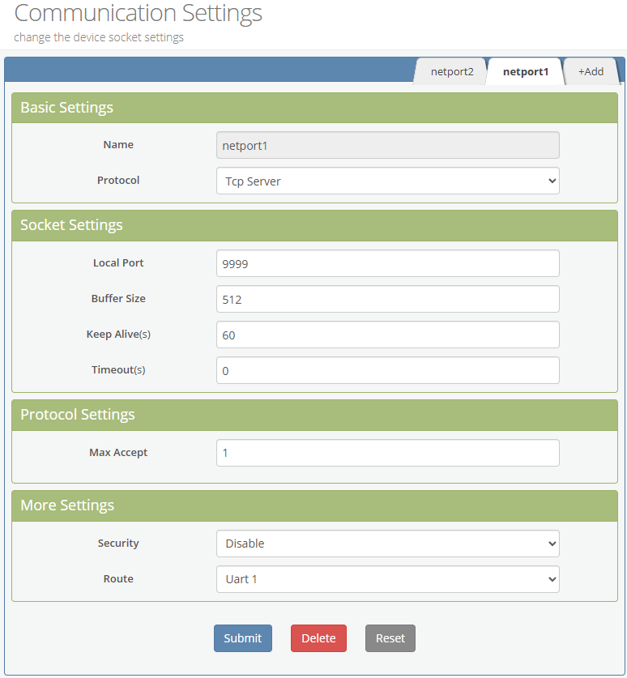
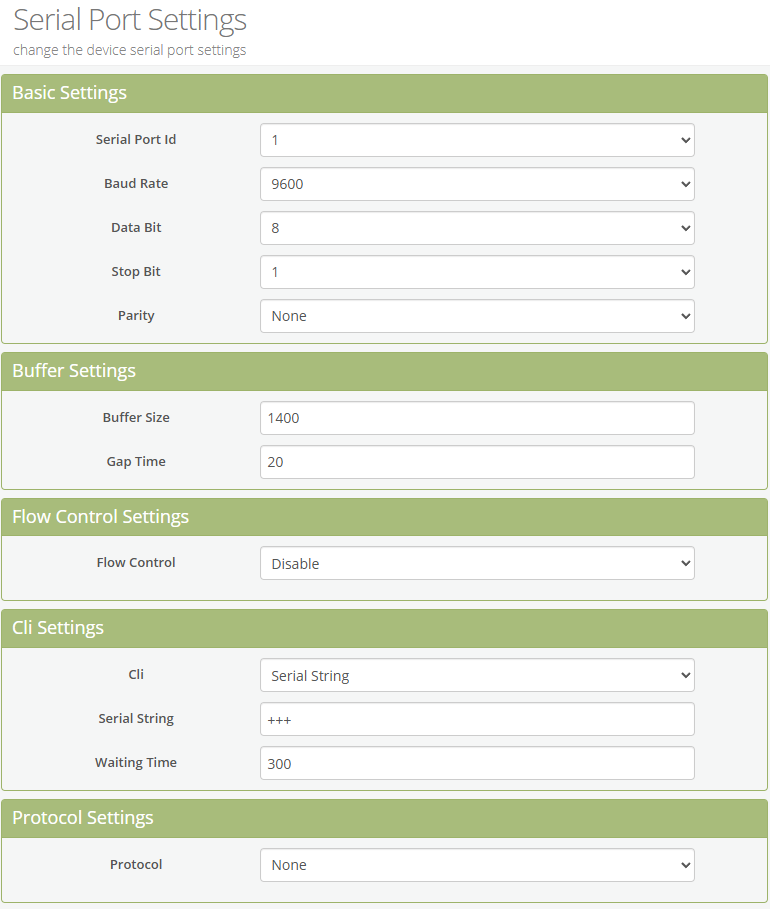
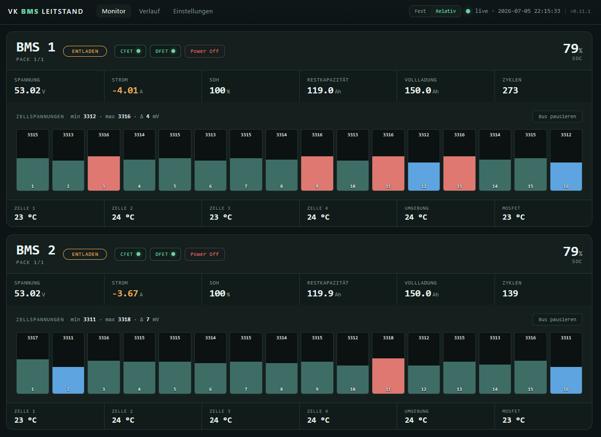
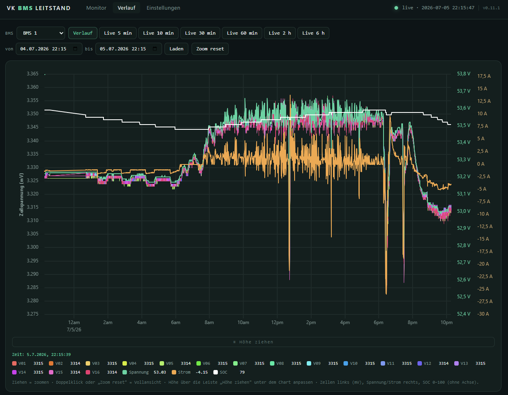
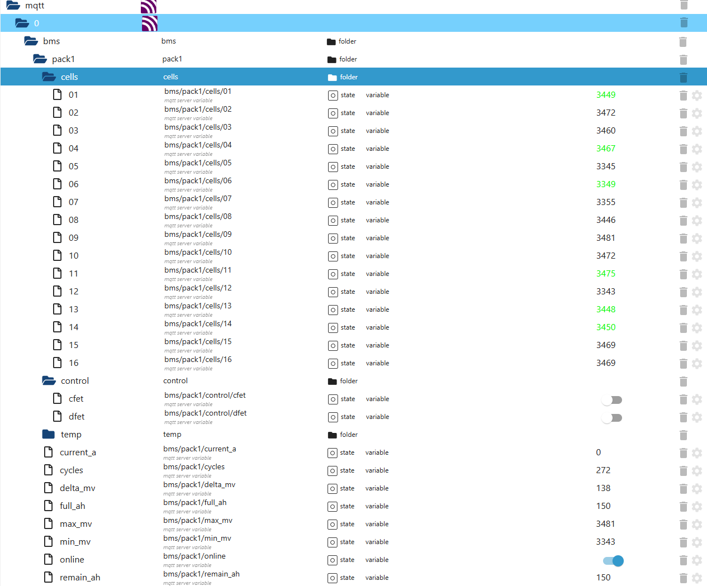

# V-KING / TAICO BMS — Unleashed

Eigenständiges Monitoring- und Steuerungs-Tool für das **VK48150**-BMS
(PACE/Pylontech-Protokollfamilie, Version `0x52`) als vollwertiger Ersatz der
Hersteller-Software. Liest alle konfigurierten Packs über **eine** Verbindung
(TCP-Gateway oder COM-Port), speichert lokal nach **SQLite**, **CSV** und/oder
**MQTT** und bietet ein **Web-Dashboard** mit Live-Werten, Verlaufs-Charts und
Einstellungen — inklusive MOS-Steuerung.

Das Protokoll wurde per .NET-Dekompilierung und Mitschnitt-Analyse vollständig
zurückentwickelt; Details in `VKING_BMS_Protokoll_Spezifikation.md`.

## Funktionen

**Monitor (Dashboard)**
- Live-Karten je Pack: Modus (Laden/Entladen/Ruhe), SOC/SOH, Spannung, Strom,
  Rest-/Vollkapazität, Zyklen, 6 Temperaturen, alle 16 Zellspannungen als Balken
  mit Min/Max- und Δ-Anzeige.
- **Master-Sub-Packs**: mehrere Adressen auf einer Leitung; Titel zweizeilig
  (Bus-Name + „Pack i/n"), Pack-Karten flach untereinander.
- **Balancing-Visualisierung**: aktuell balancierende Zellen werden markiert.
- **Warn-/Schutz-Badges** je Pack (Zelle/Pack Überspannung, Zelle-Überspannung-Schutz),
  in eigener Zeile, ohne das Layout zu verschieben.
- **Zell-Alarm** ab konfigurierbarem Schwellwert (`cell_alert_mv`).
- **Zellbalken-Maßstab umschaltbar** (fest ↔ relativ): feste Absolutskala
  (`cell_scale_min_mv`/`cell_scale_max_mv`) oder relativ um min/max herum.
- **MOS-Steuerung**: CFET/DFET schalten und Power Off — mit Bestätigungsdialog und
  Rücklese-Prüfung (bis ~2 s).
- **Pause pro Bus**: gibt die Verbindung zur Laufzeit frei (z. B. um kurzzeitig die
  Originalsoftware/VCOM auf derselben Leitung zu nutzen), ohne den Dienst zu stoppen.

**Verlauf (Chart)**
- uPlot-Diagramm: Zellspannungen (linke mV-Achse), Pack-Spannung und Strom je eigene
  rechte Achse (unabhängige Skalen, Werte mit Einheit) sowie **SOC** (feste Skala 0–100,
  ohne sichtbare Achse).
- **Verlauf** (frei wählbarer Zeitraum) oder **Live** (5/10/30/60 min, 2 h, 6 h).
- Zoom per Ziehen mit sichtbarem Auswahlbereich + Zeitspanne; im Live-Modus bleibt der
  Zoom erhalten. **Diagrammhöhe ziehbar** (Rand unten), Höhe pro Sitzung gemerkt.
- Kompakte Legende mit Ein-/Ausblenden je Serie (gefülltes Kästchen = aktiv), Werten,
  die dem Cursor folgen (inkl. Cursor-Zeit), und **Hover-Highlight** (überfahrene Linie
  hervorgehoben, Rest gedimmt). **„Alle aus/an"**-Schalter zum schnellen Filtern vieler
  Linien und ein **Cursor-Tooltip** (Name + Wert der nächstliegenden Linie am Mauszeiger). Aktives
  Zell-Balancing wird als Punkte auf der jeweiligen Zell-Linie markiert.
- Kontrastreiche 16-Farben-Palette für die Zellen; Diagrammbreite folgt dem Browserfenster.
- Verlustfreies Downsampling für große Zeiträume; SQLite-Index für schnelle Abfragen.

**Einstellungen**
- Alle Konfigurationswerte editierbar (Intervalle, Web, Alert-/Skalen-Schwellen, MQTT, Busse).
- **Busse hinzufügen/entfernen**, **Aktiv-Schalter pro Bus** (persistent), Umschaltung
  **TCP ↔ Serial** mit den jeweils passenden Feldern.
- Passwort maskiert, „Speichern & Neustarten", jederzeit sichtbarer „Dienst neu starten"-
  Button und **Datenbank-Download**.

## Installation

Voraussetzung: Python 3.9+.

```bash
pip install pyyaml flask          # Pflicht für das Web-Dashboard
pip install paho-mqtt             # nur falls MQTT genutzt wird
pip install pyserial              # nur falls direkter COM-Port statt TCP-Gateway
```

## Konfiguration

```bash
cp config.example.yaml config.yaml
```

Wichtige Werte in `config.yaml`:
- **Busse**: je Bus eine Verbindung (`tcp` mit Host/Port oder `serial` mit Port/Baudrate)
  und die Liste der **Pack-Adressen** (z. B. `[1, 2]` für Master + Sub-Pack auf einer
  Leitung). `enabled: false` nimmt einen Bus dauerhaft aus dem Polling.
- **Intervalle**: `poll_interval` (BMS-Abfrage, Frische-Basis), `live_interval`
  (Dashboard), `mqtt_interval` (Publish), `db_interval` (Datenbank). Alle Busse werden
  pro Zyklus **parallel** gelesen.
- **`cell_alert_mv`**: globaler Schwellwert, ab dem eine Zelle hervorgehoben wird (0 = aus).
- **MQTT-Broker** (Host/Port/Topic, optional Benutzer/Passwort).
- **SQLite** (`output.sqlite.path`, `retention_days`: 0 = unbegrenzt, sonst tägliche
  Bereinigung älterer Zeilen). Die WAL wird per Auto-Checkpoint laufend zusammengeführt,
  `bms.db` ist also auch im Betrieb eine vollständige Einzeldatei.

> **Wichtig:** Das Gateway erlaubt nur **eine** TCP-Verbindung gleichzeitig
> (`Max Accept = 1`). Die Hersteller-Software darf nicht parallel auf demselben Port
> verbunden sein. Über den **Pause**-Button im Dashboard kann die Verbindung kurzzeitig
> freigegeben werden.

## Starten

**Web-Dashboard (empfohlen):**
```bash
python run_web.py                # nutzt config.yaml
python run_web.py mein.yaml      # alternative Konfig
```
Dann `http://localhost:8080` öffnen (oder `http://<IP-des-PCs>:8080` im LAN). Der
Hintergrund-Poller läuft mit und schreibt weiter in SQLite/MQTT.

**Reiner Hintergrund-Logger (ohne Web):**
```bash
python run_logger.py
```
Beenden mit Ctrl-C. Für Dauerbetrieb auf einem Server siehe `deploy/README-server.md`.

### Logging / Diagnose

Global über `log_level` (`DEBUG | INFO | WARNING | ERROR`). Zusätzlich lässt sich das
Logging **pro Bus** feiner stellen (praktisch, um gezielt nur ein BMS mitzuschneiden):

```yaml
buses:
  - name: main
    # ...
    log_level: DEBUG        # nur dieser Bus: lesbare Zeile je Anfrage/Befehl
    debug_raw_frames: true  # zusätzlich vollständige TX/RX-Frames als Hex
```

Bei `DEBUG` schreibt das Tool je Abfrage/Schaltbefehl eine gut lesbare Zeile (was ans BMS
geht und was dekodiert zurückkommt, inkl. MOS-Rücklese). `debug_raw_frames: true` ergänzt
den kompletten Frame-Verkehr als Hex. Mitlesen z. B. mit `journalctl -u vkbms -f`.

**Logdatei statt Journal für DEBUG.** Damit ausführliches DEBUG nicht das systemd-Journal
aufbläht, kann eine **tägliche Logdatei** aktiviert werden. Konsole/Journal bleibt dann bei
`log_level` (z. B. INFO), die Datei fängt DEBUG/Rohframes ab:

```yaml
log_level: INFO
log_file:
  enabled: true
  path: data/logs/vkbms.log
  level: DEBUG          # Datei-Ebene (unabhängig vom Journal)
  retention_days: 2     # tägliche Rotation, 2 Dateien behalten
```

Zusätzlich setzt die systemd-Unit `LogLevelMax=info`, sodass der Dienst ohnehin nichts
unter INFO ins Journal schreibt. Alles auch über die **Einstellungs-Seite** konfigurierbar
(inkl. `read_status`, Log-Level und Rohframes **pro Bus**).

Auf der Einstellungs-Seite gibt es außerdem **„Log herunterladen – aktuell / alles (ZIP)"**
und **„Log leeren"** (löscht aktuelle Datei + rotierte Backups). Ein optionaler
**DEBUG-Auto-Reset** (`debug_auto_reset: {enabled, minutes}`) stellt erhöhtes Logging
(Konsole-DEBUG bzw. Bus-DEBUG/Rohframes) nach X Minuten automatisch auf INFO zurück –
nur zur Laufzeit, die `config.yaml` bleibt unverändert. Eine aktive DEBUG-**Logdatei**
gilt dabei als gewollter Dauerzustand und wird vom Auto-Reset nicht angetastet.

Schaltbefehle werden mit ihrer **Quelle** protokolliert, z. B.
`MOS … [Quelle: MQTT]` bzw. `[Quelle: Web]`. Nach einem **Power Off** wird das erwartete
kurzzeitige Offline nicht als Fehler, sondern als „… nach Power Off vorübergehend offline
(erwartet)" geloggt.

## MQTT-Topics

Pro Pack wird eindeutig je Bus adressiert: `bms/<name>/pack<id>/…` (`<name>` =
Bus-Name aus der Config, kleingeschrieben/ohne Leerzeichen, z. B. `bms1`). Damit ist
„BMS 1, Adresse 2" klar von „BMS 2" getrennt.

- `bms/status` → `online` / `offline` (Gesamt-Tool, via Last-Will)
- `bms/<name>/pack<id>/online` → `true` / `false` (antwortet das BMS? 3-Fehlversuch-Toleranz;
  deaktivierte/pausierte Busse werden `false`)
- `bms/<name>/pack<id>/voltage_v`, `current_a`, `soc`, `soh`, `remain_ah`, `full_ah`,
  `cycles`, `min_mv`, `max_mv`, `delta_mv`
- `bms/<name>/pack<id>/cells/01` … `cells/16` (Einzelzellen, abschaltbar via `publish_cells`)
- `bms/<name>/pack<id>/temp/cell_t1` … `temp/mos_t`
- `bms/<name>/pack<id>/balance_mask` (16-Bit) und `…/balancing` (Liste aktiver Zellen)
- `bms/<name>/pack<id>/alarm`, `…/warnings`, `…/protections`
- `bms/<name>/pack<id>/control/cfet`, `control/dfet` → **schreibbares** Objekt:
  zeigt den aktuellen FET-Status **und** schaltet bei Wertänderung (ein Objekt für
  Status und Befehl; die eigenen Rückmeldungen des Tools werden nicht als Befehl
  gewertet, keine Schleife).
- `bms/<name>/pack<id>/control/poweroff` → schreibbar; `true` löst Power Off aus und
  wird danach automatisch auf `false` zurückgesetzt (Momentschalter).

> Hinweis (ioBroker): Da `poweroff` ein Momentschalter ist (springt nach dem Auslösen
> sofort zurück auf `false`), wirkt ein Schalter-Widget optisch immer „aus". Das ist
> korrekt — Power Off ist ein kurzer Auslöser, kein Dauerzustand. Für eine klarere
> Darstellung den Datenpunkt als **Button** einbinden (Button-Widget bzw. `role: button`).
- `bms/<name>/pack<id>/state` → Gesamt-JSON (nur wenn `publish_state_json: true`)

> Hinweis: Lehnt das BMS ein Schalten ab (z. B. Last aktiv), springt das Objekt beim
> nächsten Zyklus auf den echten Zustand zurück — das ist korrektes Verhalten, kein Fehler.

## JSON-API (Web)

`GET /api/state` (Live-Stand), `GET /api/history` (Verlauf, downsampled),
`POST /api/mos` (CFET/DFET schalten), `POST /api/poweroff`, `POST /api/pause`
(Bus pausieren/fortsetzen), `GET /api/db/download` (SQLite herunterladen),
`POST /api/log/clear` (alle Logdateien löschen), `GET /api/log/download?scope=current|all`
(aktuelle Datei bzw. alle als ZIP), `GET/POST /api/config`, `POST /api/restart`.

### Zugriff einschränken

Zwei Ebenen, unabhängig voneinander:

- **`web.host`** legt nur fest, an welche eigene Schnittstelle der Dienst bindet
  (`0.0.0.0` = alle, `127.0.0.1` = nur lokal, oder eine feste eigene IP) — **nicht**, wer
  zugreifen darf.
- **`web.allow_networks`** (CIDR-Liste, in den Einstellungen editierbar) beschränkt die
  erlaubten **Quell-Netze**, z. B. `192.168.2.0/24`. Leer = keine Einschränkung; localhost
  ist immer erlaubt. Hinter einem Reverse-Proxy/WAF wird `X-Forwarded-For` nur ausgewertet,
  wenn die Anfrage von einer in **`web.trusted_proxies`** eingetragenen IP kommt
  (Spoofing-Schutz). Aus der XFF-Kette gilt die erste nicht-vertrauenswürdige Adresse als
  echter Client (funktioniert auch mit verketteten Proxys).

Für harte Absicherung bleibt zusätzlich **systemd** (`IPAddressAllow` in `deploy/vkbms.service`,
z. B. `192.168.2.0/24`) bzw. Firewall/WAF die robustere Ebene — `allow_networks` ist eine
bequeme, GUI-editierbare Zusatzschicht.

## FET-Schaltverhalten / BMS-Verriegelung

- **CFET = Charge-FET** → steuert den **Lade**pfad.
- **DFET = Discharge-FET** → steuert den **Entlade**pfad.

Das BMS besitzt eine Schutzverriegelung: **Unter Last ist nur der FET des gerade
aktiven Vorgangs schaltbar**, der andere wird abgelehnt. Konkret beobachtet und bestätigt:

- **Laden aktiv:** CFET schaltbar, **DFET wird abgelehnt**.
- **Entladen aktiv:** DFET schaltbar, **CFET wird abgelehnt**.
- **Ruhe (kein Strom):** beide FETs frei schaltbar.

Lehnt das BMS ab, sendet das Tool den Befehl korrekt (die Maske stimmt), das BMS
übernimmt ihn aber nicht und meldet beim Rücklesen den alten Zustand. Im Monitor
erscheint dann der Hinweis „BMS hat das Schalten abgelehnt (unter Last nur der aktive
FET schaltbar)". Das ist **erwartetes Verhalten**, kein Fehler des Tools. Um einen FET
unter Last zu öffnen, zuerst den Strom wegnehmen (Verbraucher/Ladequelle trennen bzw.
Ruhezustand abwarten).

**Power Off nur am Main-Pack.** Der Power-Off-Reset (EF) wirkt nur am direkt
angebundenen Pack. Über den Adressbus angesprochene Sub-Packs können damit nicht
zurückgesetzt werden. Pro Bus wird die **Main-Adresse** (genau ein Wert, Pflicht) und
optional **Sub-Adressen** (weitere Packs) gesetzt; nur am Main-Pack ist der Power-Off-Button
sichtbar (im Monitor mit „Main" gekennzeichnet). Ist die Main-Adresse nicht gesetzt, wird
Power Off mit einem Hinweis blockiert.

**Seriennummer/Produktinfo.** Modell, Firmware und Seriennummer werden je Pack einmalig
über CID2 F1 ausgelesen und im Monitor als graue Zeile (z. B. „VK48150 · SN … · FW V15.53")
angezeigt. Über MQTT werden sie einmalig (retained) unter `bms/<pack>/info/{manufacturer,
model,version,serial}` veröffentlicht — nicht bei jedem Poll.

### Erfasste vs. noch offene Status-Flags

Verifiziert dekodiert: **CFET-/DFET-Zustand**, Stromrichtung (Laden/Entladen/Ruhe),
sowie die Überspannungs-Meldungen (Warnung: Zelle/Pack Überspannung; Schutz: Zelle
Überspannung). **Noch nicht dekodiert** (mangels Mitschnitten): Unterspannung,
Über-/Untertemperatur, Überstrom (Laden/Entladen), Kurzschluss. Der Current-Limit-Zustand
lässt sich senden, aber nicht aus dem Status zurücklesen.

## Projektstruktur

```
vkbms/
  protocol.py        Frame-Bau/-Parsing, Prüfsummen, Wert-Dekoder (Analog inkl.
                     Balancing-Maske, Status inkl. Warn-/Schutz-/FET-Bits)
  transport.py       TCP- und Serial-Transport mit Reassemblierung/Reconnect
  sinks.py           SQLite-, CSV- und MQTT-Senken
  poller.py          Polling-Engine, MOS-Steuerung, Pause + headless Logger
  server.py          Flask-Webserver + Hintergrund-Poller + JSON-API
  web/
    index.html       Live-Dashboard (Monitor)
    chart.html       Verlauf/Live-Chart (uPlot)
    settings.html    Einstellungen
    vendor/          uPlot (offline)
run_web.py           Einstiegspunkt Web-Dashboard
run_logger.py        Einstiegspunkt headless
config.example.yaml  Vorlage für config.yaml
deploy/              systemd-Unit + Server-Anleitung
docs/                Screenshots, Gateway-Konfiguration
```

## Hardware-Anbindung (TCP-RS232-Device-Server)

Das BMS spricht RS232; ich binde es über einen Ethernet-Seriell-Gateway ins Netz ein,
sodass kein PC direkt am BMS hängen muss. Verwendet wird ein
[Hi-Flying HF5122](http://www.hi-flying.com/hf5122) — grundsätzlich sollte aber jeder
VCOM-fähige Seriell-zu-Ethernet-Adapter funktionieren.

**Netzwerk-Port (TCP-Server):** Pro BMS-Leitung ein Port im Modus *TCP Server*. Der
lokale Port (hier `9999`) ist später `connection.port` in der `config.yaml`, die Route
zeigt auf den passenden UART. Entscheidend ist **`Max Accept = 1`** — der Gateway lässt
nur **eine** Verbindung gleichzeitig zu, also entweder dieses Tool *oder* die
Hersteller-Software. `Timeout = 0` lässt die Verbindung offen.



**Serielle Parameter:** Das VK48150-BMS arbeitet mit **9600 Baud, 8 Datenbits, kein
Paritätsbit, 1 Stoppbit (8N1)**, ohne Flusskontrolle. Diese Werte müssen am Gateway exakt
so gesetzt sein.



## Screenshots

**Monitor** — Live-Übersicht beider Packs, nach Bus gruppiert: Modus, SOC, Messwerte,
Zellbalken mit Min/Max/Δ, Balancing-Markierung, Warn-/Schutz-Badge sowie CFET/DFET- und
Power-Off-Steuerung je Pack.



**Verlauf** — Zellspannungen, Pack-Spannung und Strom auf eigenen Achsen, mit Live-Modi,
Zoom und cursorgenauer Werteanzeige in der Legende.



**MQTT in ioBroker** — die veröffentlichten Topics je Pack: Einzelzellen unter `cells/`,
Steuerung unter `control/` (CFET/DFET), Temperaturen, Kennwerte und der Online-Status.



## Stand & Roadmap

Aktuelle Version: **v0.14.3**. Änderungen je Release in `CHANGELOG.md`, geplante Punkte
in `ROADMAP.md`.

## Mitwirkung / Attribution

Dieses Projekt entsteht in Zusammenarbeit: Das **Coding übernimmt Claude (Anthropic)**,
die Funktionen werden **gemeinsam erarbeitet**. Anforderungen, Architekturentscheidungen,
die Richtung des Protokoll-Reverse-Engineering, das Testen am realen BMS sowie alle
Korrekturen und Verfeinerungen stammen von **Gesiima**; Claude setzt sie iterativ in Code
um. Es wurde kein Code manuell geschrieben — die Umsetzung erfolgt vollständig über
schrittweise Anweisungen und gemeinsame Abstimmung.
